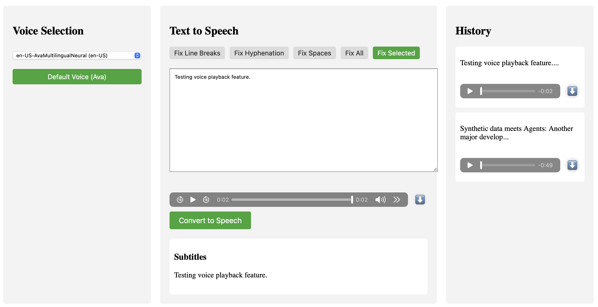

# the-voice
A simple application for TTS and utilities



## Main Features

1. **Voice Selection** (Left Panel)
   - Multiple TTS voices available
   - Quick access to default Ava voice
   - Priority sorting for pt-BR and en-US voices

2. **Text Input and Processing** (Center Panel)
   - Large text input area
   - Text cleanup utilities:
     - Fix Line Breaks: Removes unnecessary line breaks, perfect for cleaning up text copied from PDFs or emails.
     - Fix Hyphenation: Fixes hyphenated words split across lines, ensuring smooth reading.
     - Fix Spaces: Normalizes spacing, removing extra spaces and ensuring consistent formatting.
     - Fix All: Applies all fixes in one go, saving time and effort.
     - Fix Selected: Applies fixes to selected text only, giving you precise control over text formatting.
   - Real-time audio preview
   - Download option for generated audio
   - Subtitle display

3. **History** (Right Panel)
   - Keeps track of previous conversions
   - Quick access to past audio files
   - Download option for each entry

4. **Processing Feedback**
   - Visual loading indicators
   - Progress overlay during conversion
   - Error handling with user notifications

## Requirements
- Python 3.8+
- pip

## Installation and Running

1. Clone the repository:
    ```sh
    git clone https://github.com/yourusername/the-voice.git
    cd the-voice
    ```

2. Create and activate a virtual environment (recommended):
    ```sh
    python3 -m venv venv
    source venv/bin/activate  # On macOS/Linux
    # or
    .\venv\Scripts\activate  # On Windows
    ```

3. Install the dependencies:
    ```sh
    pip install -r requirements.txt
    ```

4. Run the application:
    ```sh
    python app.py
    ```

The application will open in your default web browser. If it doesn't open automatically, navigate to `http://localhost:5000`.

### Troubleshooting

- If you get permission errors, try running pip with sudo: `sudo pip install -r requirements.txt`
- Make sure you have Python 3.8 or higher installed: `python --version`
- For audio playback issues, ensure your system's audio output is properly configured